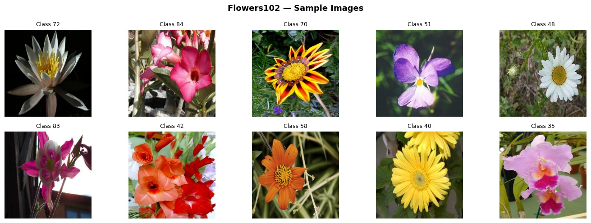
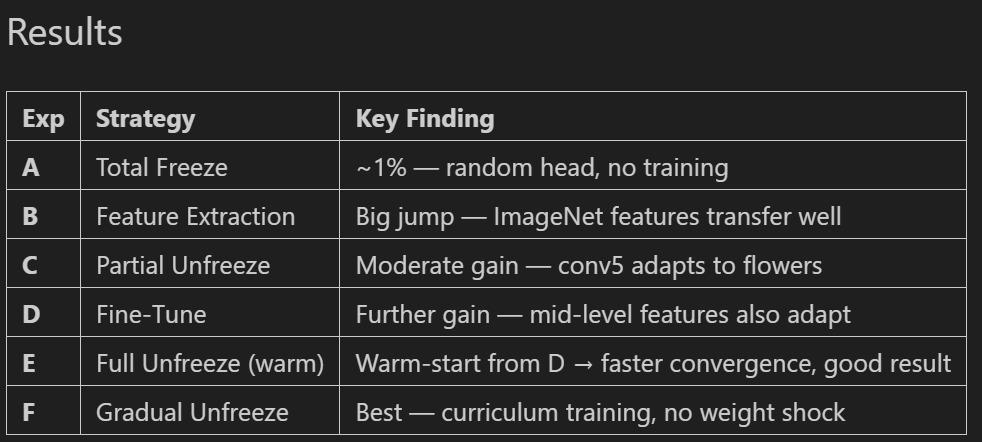
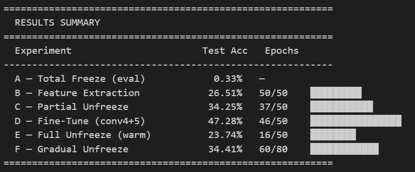
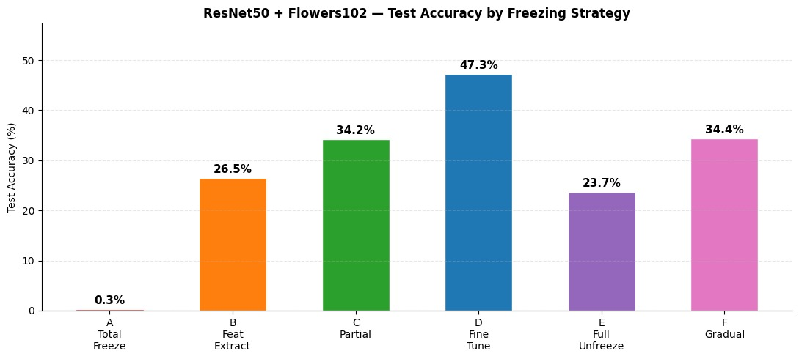
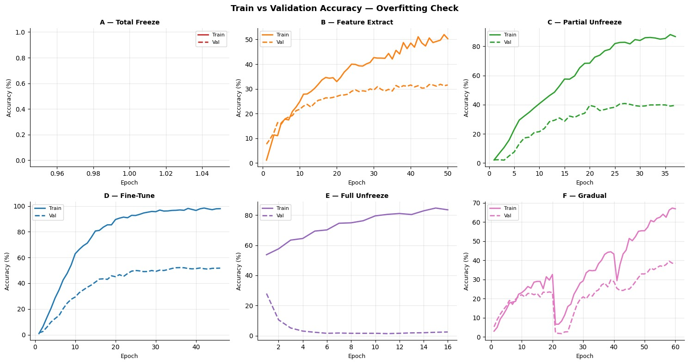
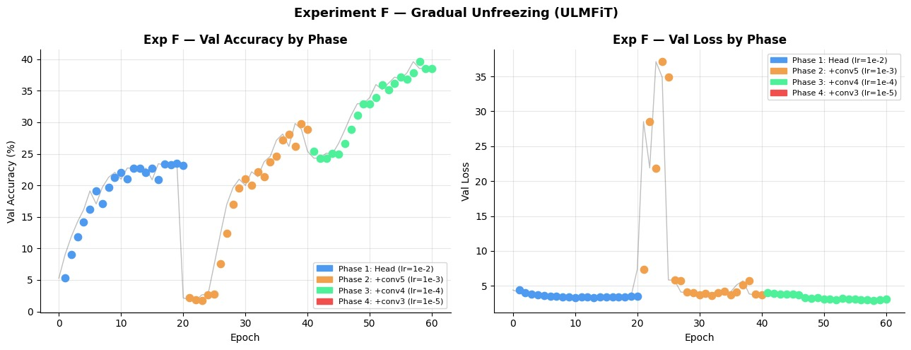
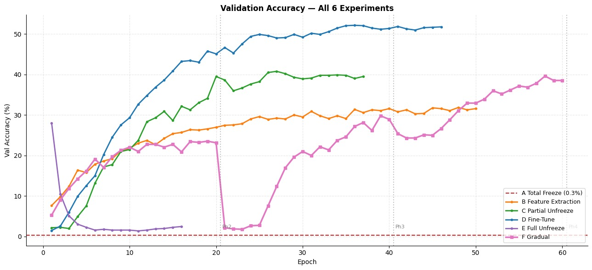
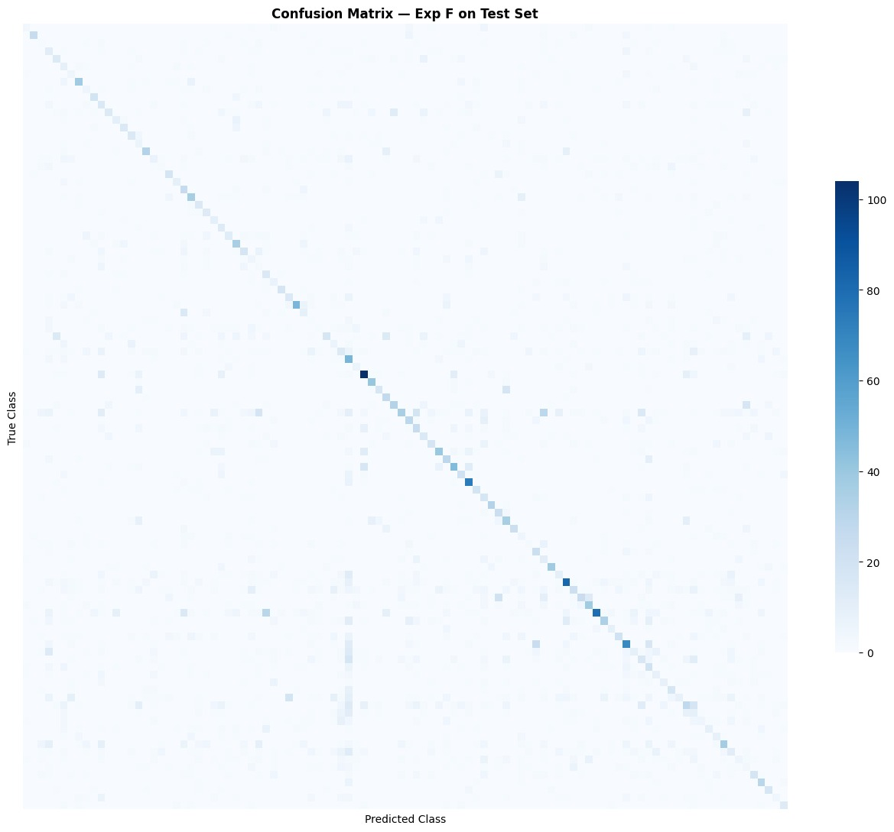

# Transfer-Learning-ResNet50-Flowers102

> **Comparative Study of Transfer Learning Strategies using ResNet50 on the Oxford Flowers102 Dataset**


---


## 🌸 Overview

This repository contains the implementation of our **Deep Learning group assignment** on **Transfer Learning** using **ResNet50** pretrained on **ImageNet** for fine-grained flower classification on the **Oxford Flowers102** dataset.

The objective of this project is to investigate how different transfer learning strategies affect model performance when only a limited amount of labelled training data is available. Six transfer learning approaches were implemented and compared, ranging from complete feature extraction to gradual layer unfreezing.

Experiments demonstrate the impact of layer freezing, learning rate selection, and catastrophic forgetting on model performance, providing practical insights into fine-tuning pretrained convolutional neural networks for small datasets.

---

## ✨ Features

- ResNet50 pretrained on ImageNet
- Oxford Flowers102 dataset
- Six transfer learning strategies
- Feature extraction and fine-tuning
- Gradual unfreezing (ULMFiT-inspired)
- Early Stopping and ReduceLROnPlateau
- Comparative performance analysis
- Confusion matrix and overfitting analysis
- Validation accuracy comparison across all experiments

---

## 📂 Repository Structure

```text
Transfer-Learning-ResNet50-Flowers102/
│
├── notebooks/
│   └── transfer_learning.ipynb
│
├── docs/
│   ├── Report.pdf
│   └── images/
│       ├── flowers102_samples.jpeg
│       ├── freezing_strategies.jpeg
│       ├── results_summary.jpeg
│       ├── test_accuracy_comparison.jpeg
│       ├── validation_accuracy_curves.jpeg
│       ├── gradual_unfreezing_analysis.jpeg
│       ├── overfitting_analysis.jpeg
│       └── confusion_matrix.jpeg
│
├── data/
│   └── README.md
│
├── requirements.txt
├── .gitignore
├── LICENSE
└── README.md
```

---

# 🌼 Dataset

The experiments were conducted using the **Oxford Flowers102** dataset, a benchmark dataset for fine-grained image classification.

### Dataset Statistics

| Split | Images | Classes |
|-------|-------:|--------:|
| Train | 1,020 | 102 |
| Validation | 1,020 | 102 |
| Test | 6,149 | 102 |

### Why Flowers102?

The dataset contains **102 flower species**, but only **10 training images per class**, making it an ideal benchmark for evaluating transfer learning under limited-data conditions.

Instead of training a deep CNN from scratch, the project leverages pretrained ImageNet features to improve learning efficiency and classification performance.

---

## 🌺 Sample Images

<p align="center">
  
</p>

<p align="center">
  <em>Sample images from the Oxford Flowers102 dataset.</em>
</p>

---

## 🎯 Project Objectives

The primary goals of this project are to:

- Understand the fundamentals of transfer learning.
- Compare different freezing and fine-tuning strategies.
- Evaluate the effect of progressively unfreezing pretrained layers.
- Analyze catastrophic forgetting during full fine-tuning.
- Identify the most effective strategy for small-scale image classification tasks.

---

## 📌 Transfer Learning Strategies Evaluated

Six different experiments were conducted.

| Experiment | Strategy |
|------------|-----------------------------|
| A | Total Freeze (Evaluation Only) |
| B | Feature Extraction |
| C | Partial Unfreezing (conv5_x) |
| D | Fine-Tuning (conv4_x + conv5_x) |
| E | Full Unfreezing |
| F | Gradual Unfreezing (ULMFiT) |

---

# 🔄 Project Workflow

The project follows a standard transfer learning pipeline, beginning with a pretrained ResNet50 model and progressively evaluating different freezing strategies on the Oxford Flowers102 dataset.

```text
Oxford Flowers102 Dataset
            │
            ▼
Image Preprocessing
(Resize + Normalization)
            │
            ▼
Pretrained ResNet50
(ImageNet Weights)
            │
            ▼
Replace Classification Head
            │
            ▼
Transfer Learning Strategy
(A → F)
            │
            ▼
Model Training
            │
            ▼
Performance Evaluation
            │
            ▼
Accuracy & Loss Analysis
Confusion Matrix
Overfitting Analysis
```

---

# 🧠 Model Architecture

The project uses **ResNet50**, a 50-layer deep residual convolutional neural network pretrained on the **ImageNet** dataset.

Instead of training the network from scratch, the pretrained feature extractor is reused and a custom classification head is attached for the Flowers102 classification task.

### Custom Classification Head

```text
ResNet50 Backbone
        │
        ▼
GlobalAveragePooling2D
        │
        ▼
Dense (256, ReLU)
        │
        ▼
Dropout (0.2)
        │
        ▼
Dense (102, Softmax)
```

### Architecture Summary

| Component | Configuration |
|------------|--------------|
| Backbone | ResNet50 (ImageNet Pretrained) |
| Pooling | GlobalAveragePooling2D |
| Dense Layer | 256 Units (ReLU) |
| Dropout | 0.2 |
| Output Layer | 102-way Softmax |

---

# 🧊 Layer Freezing Strategy

To understand how transfer learning behaves under different training conditions, six experiments were performed by progressively unfreezing deeper layers of the pretrained ResNet50 backbone.

<p align="center">
  
</p>

---

## Experiments

### 🟦 Experiment A — Total Freeze

- Entire backbone frozen
- Classification head frozen
- No training performed
- Used only as a baseline

---

### 🟩 Experiment B — Feature Extraction

- Entire ResNet50 backbone frozen
- Only the custom classification head trained

This evaluates how well ImageNet features transfer without modifying pretrained weights.

---

### 🟨 Experiment C — Partial Unfreezing

Trainable Layers:

- conv5_x
- Classification head

Lower-level feature extractors remain frozen while the highest semantic layers adapt to the flower dataset.

---

### 🟧 Experiment D — Fine-Tuning

Trainable Layers:

- conv4_x
- conv5_x
- Classification head

A smaller learning rate is used to preserve useful pretrained representations while adapting higher-level features.

This configuration achieved the **best overall performance**.

---

### 🟥 Experiment E — Full Unfreezing

Every layer of ResNet50 is trained simultaneously.

Although this provides maximum flexibility, it also introduces a high risk of **catastrophic forgetting**, particularly on small datasets.

---

### 🟪 Experiment F — Gradual Unfreezing

Inspired by the ULMFiT training strategy, layers are unfrozen progressively across multiple training phases.

Training schedule:

Phase 1

- Train classification head

↓

Phase 2

- Unfreeze conv5_x

↓

Phase 3

- Unfreeze conv4_x

This gradual adaptation helps stabilize optimization and reduces destructive updates to pretrained features.

---

# ⚙️ Training Configuration

The same training pipeline was used for all experiments, with only the freezing strategy changing between runs.

| Parameter | Value |
|------------|------:|
| Backbone | ResNet50 |
| Pretrained Weights | ImageNet |
| Input Size | 224 × 224 × 3 |
| Optimizer | Adam |
| Loss Function | Sparse Categorical Crossentropy |
| Maximum Epochs | 50 |
| Batch Size | 32 |

---

## Training Callbacks

To improve convergence and reduce overfitting, the following callbacks were used:

- Early Stopping
- ReduceLROnPlateau
- Best Model Weight Restoration

These callbacks automatically terminate training when validation performance no longer improves and reduce the learning rate when optimization stagnates.

---

# 📊 Evaluation Metrics

Model performance was evaluated using multiple complementary metrics.

### Classification Accuracy

Measures the percentage of correctly classified flower images.

---

### Training Loss

Tracks optimization progress throughout training.

---

### Validation Accuracy

Evaluates the model's ability to generalize to unseen validation data.

---

### Confusion Matrix

Provides class-wise prediction analysis for the best-performing model.

---

### Overfitting Analysis

Compares training and validation accuracy curves to identify memorization and generalization behavior.

---

# 🎯 Why Compare Multiple Freezing Strategies?

Transfer learning performance depends heavily on:

- Dataset size
- Task similarity
- Number of trainable parameters

This project compares six widely used strategies to identify the most effective approach for **small-scale image classification**.

The experiments highlight the trade-offs between feature reuse, fine-tuning capacity, computational cost, and the risk of catastrophic forgetting.

---

# 📈 Experimental Results

Six transfer learning strategies were implemented and evaluated using the same training configuration. The experiments investigate how different freezing policies influence classification performance on the Oxford Flowers102 dataset.

---

# 🏆 Results Summary

<p align="center">
  
</p>

The summary highlights the impact of progressively unfreezing layers of the pretrained ResNet50 backbone.

Among all strategies, **Experiment D (Fine-Tuning)** achieved the highest test accuracy, demonstrating the effectiveness of selectively adapting higher-level feature representations while preserving pretrained low-level features.

---

# 📊 Test Accuracy Comparison

<p align="center">
  
</p>

## Test Accuracy of Each Experiment

| Experiment | Strategy | Test Accuracy |
|------------|-------------------------------|--------------:|
| A | Total Freeze | **0.33%** |
| B | Feature Extraction | **26.51%** |
| C | Partial Unfreezing (conv5_x) | **34.25%** |
| D | Fine-Tuning (conv4_x + conv5_x) | **47.28%** |
| E | Full Unfreezing | **23.74%** |
| F | Gradual Unfreezing | **34.41%** |

---

## Performance Analysis

### Experiment A — Total Freeze

- No trainable parameters.
- Performs close to random guessing.
- Serves as a baseline for comparison.

---

### Experiment B — Feature Extraction

- ImageNet features transfer reasonably well.
- Significant improvement without modifying pretrained weights.

---

### Experiment C — Partial Unfreezing

- Fine-tuning only the deepest residual block improves feature adaptation.
- Better representation learning than pure feature extraction.

---

### Experiment D — Fine-Tuning

- Best-performing configuration.
- Successfully balances pretrained knowledge with task-specific learning.
- Achieved the highest classification accuracy (**47.28%**).

---

### Experiment E — Full Unfreezing

- Training every layer leads to unstable optimization.
- Performance decreases because of catastrophic forgetting and limited training data.

---

### Experiment F — Gradual Unfreezing

- Progressive layer adaptation stabilizes training.
- Performs better than full unfreezing while reducing destructive updates.
- Although not surpassing Experiment D, it demonstrates improved optimization stability.

---

# 📉 Validation Accuracy Curves

<p align="center">
  
</p>

The validation curves compare learning behavior across all six experiments.

### Observations

- Experiment A shows almost no learning.
- Feature extraction converges quickly but plateaus early.
- Partial fine-tuning improves convergence.
- Experiment D consistently achieves the highest validation accuracy.
- Full unfreezing exhibits unstable learning.
- Gradual unfreezing produces smoother convergence than full fine-tuning.

---

# 🔄 Gradual Unfreezing Analysis

<p align="center">
  
</p>

Experiment F progressively unfreezes deeper layers of ResNet50 during training.

Instead of updating every layer simultaneously, the network adapts in stages, allowing pretrained representations to remain stable while gradually learning task-specific features.

This approach helps reduce catastrophic forgetting and produces smoother optimization compared with full fine-tuning.

---

# 📉 Overfitting Analysis

<p align="center">
  
</p>

Training and validation accuracy curves were examined to evaluate generalization.

### Findings

- Feature extraction exhibits minimal overfitting.
- Partial fine-tuning improves validation performance while maintaining stability.
- Full unfreezing shows greater variance and signs of overfitting.
- Fine-tuning selected residual blocks provides the best balance between learning capacity and generalization.

---

# 🔍 Confusion Matrix

<p align="center">
  
</p>

The confusion matrix visualizes prediction performance for the best-performing model.

It illustrates:

- Correctly classified flower categories.
- Frequently confused classes.
- Overall class-wise prediction distribution.

The matrix indicates that visually similar flower species remain the most challenging to distinguish, while many classes achieve high classification accuracy.

---

# 💡 Key Findings

- Fine-tuning only the upper residual blocks (**conv4_x + conv5_x**) produced the highest classification accuracy.
- Pretrained ImageNet features transferred effectively even with limited training data.
- Updating every layer simultaneously reduced performance because of catastrophic forgetting.
- Progressive layer unfreezing improved optimization stability compared with full fine-tuning.
- Selective fine-tuning provides the best trade-off between computational efficiency and predictive performance.

---

# 📌 Conclusion

This comparative study demonstrates that **transfer learning is highly effective for small-scale image classification tasks**.

Among the six evaluated strategies, **Fine-Tuning (Experiment D)** achieved the best overall performance by allowing higher-level semantic features to adapt while preserving robust low-level representations learned from ImageNet.

The experimental results highlight the importance of selecting an appropriate freezing strategy rather than simply training every layer, particularly when working with limited datasets.

# 🚀 Installation

## Clone the Repository

```bash
git clone https://github.com/<your-username>/Transfer-Learning-ResNet50-Flowers102.git
cd Transfer-Learning-ResNet50-Flowers102
```

---

## Create a Virtual Environment (Optional)

```bash
python -m venv venv
```

### Windows

```bash
venv\Scripts\activate
```

### Linux / macOS

```bash
source venv/bin/activate
```

---

## Install Dependencies

```bash
pip install -r requirements.txt
```

---

# ▶️ Usage

Launch Jupyter Notebook:

```bash
jupyter notebook
```

Open:

```text
notebooks/transfer_learning.ipynb
```

Run all notebook cells sequentially to:

- Load the Oxford Flowers102 dataset
- Build the ResNet50 transfer learning model
- Train the six transfer learning strategies
- Compare validation performance
- Evaluate on the test dataset
- Generate performance visualizations

---

# 📦 Requirements

Major libraries used in this project include:

- Python 3.10+
- TensorFlow
- TensorFlow Datasets
- NumPy
- Matplotlib
- Seaborn
- Scikit-learn

Install all dependencies using:

```bash
pip install -r requirements.txt
```

---

# 📚 References

1. He, K., Zhang, X., Ren, S., & Sun, J. (2016). *Deep Residual Learning for Image Recognition*. Proceedings of the IEEE Conference on Computer Vision and Pattern Recognition (CVPR).

2. Nilsback, M. E., & Zisserman, A. (2008). *Automated Flower Classification over a Large Number of Classes*. Indian Conference on Computer Vision, Graphics & Image Processing (ICVGIP).

3. TensorFlow Documentation

4. TensorFlow Datasets Documentation

5. Keras Applications Documentation

---

# 👥 Team

This project was developed as part of the **Deep Learning** coursework.

| Name | Role |
|------|------|
| Praveena P. | Model Development, Experiments, Documentation |
| Awantika Krishna | Model Development, Analysis |
| Bindiya Anand | Experimental Evaluation, Documentation |

---

# 📄 Report

The complete project report is available in:

```text
docs/Report.pdf
```

The report includes:

- Introduction
- Literature Review
- Dataset Description
- Methodology
- Experimental Design
- Results
- Performance Analysis
- Conclusion
- References

---

# 📜 License

This project is licensed under the **Creative Commons Zero v1.0 Universal (CC0 1.0)** License.

You are free to use, modify, distribute, and build upon this work without restrictions.

See the [LICENSE](LICENSE) file for details.

---

# 🙏 Acknowledgements

We would like to acknowledge:

- **TensorFlow** and **Keras** for providing an accessible deep learning framework.
- The **Oxford Visual Geometry Group (University of Oxford)** for making the Flowers102 dataset publicly available.
- The creators of **ResNet50**, whose pretrained ImageNet weights enabled efficient transfer learning.
- Our course instructors for their guidance throughout this project.

---

# ⭐ Support

If you found this repository useful, consider giving it a ⭐ on GitHub.

It helps others discover the project and supports future development.

---

<p align="center">
  <b>Transfer Learning with ResNet50 for Fine-Grained Flower Classification 🌸</b>
</p>
